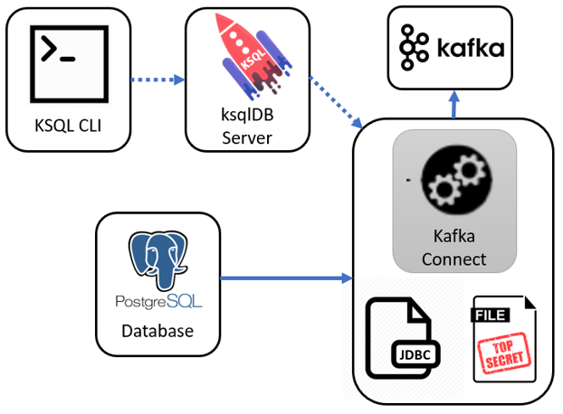

# Kafka Connect with ksqlDB 
How to setup Kafka Connect with ksqlDB .. and externalizing secrets





## Startup this project

```
docker-compose up -d
```

## Setup database

```
cat postgres-setup.sql

docker-compose exec postgres psql -U postgres -f /postgres-setup.sql
```

To look at the Postgres table
```
docker-compose exec postgres psql -U postgres -c "select * from socks;"
```


## ksqlDB CLI
```
docker-compose exec ksql-cli ksql http://ksql-server:8088
```


## Bad
Please **don't** do this - the password is obvious

```
CREATE SOURCE CONNECTOR `postgres-jdbc-source` WITH(
  "connector.class"='io.confluent.connect.jdbc.JdbcSourceConnector',
  "connection.url"='jdbc:postgresql://postgres:5432/postgres',
  "mode"='incrementing',
  "incrementing.column.name"='ref',
  "table.whitelist"='socks',
  "connection.user"='postgres',
  "connection.password"='Sup3rS3c3t',
  "topic.prefix"='db-',
  "key"='sockname');
```

# Better
Create a _secrets_ file like `credentials.properties` this
```
PG_URI=jdbc:postgresql://postgres:5432/postgres
PG_USER=postgres
PG_PASS=Sup3rS3c3t
```
And then you can concentrate on defining your configuratin like this

```
CREATE SOURCE CONNECTOR `postgres-jdbc-source` WITH(
  "connector.class"='io.confluent.connect.jdbc.JdbcSourceConnector',
  "connection.url"='${file:/scripts/credentials.properties:PG_URI}',
  "mode"='incrementing',
  "incrementing.column.name"='ref',
  "table.whitelist"='socks',
  "connection.user"='${file:/scripts/credentials.properties:PG_USER}',
  "connection.password"='${file:/scripts/credentials.properties:PG_PASS}',
  "topic.prefix"='db-',
  "key"='sockname');
```

## Check it
From ksqlDB run this

```
docker-compose exec ksql-cli ksql http://ksql-server:8088

print 'db-socks' from beginning;
```

And you should see this
```
{"sockname": "Black wool socks", "ref": 1}
{"sockname": "Yellow colourful socks", "ref": 2}
{"sockname": "Old brown socks", "ref": 3}
```

In another window, insert a new database row
```
docker exec -it postgres psql -U postgres -c "INSERT INTO socks (sockname) VALUES ('Mismatched socks');"
```

And your ksqlDB should quickly show one additional row
```
{"sockname": "Mismatched socks", "ref": 4}
```
